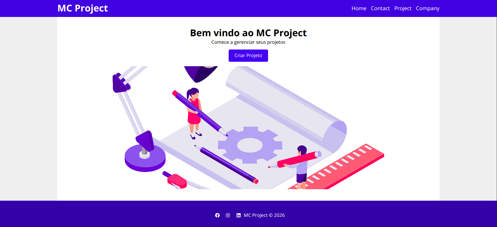
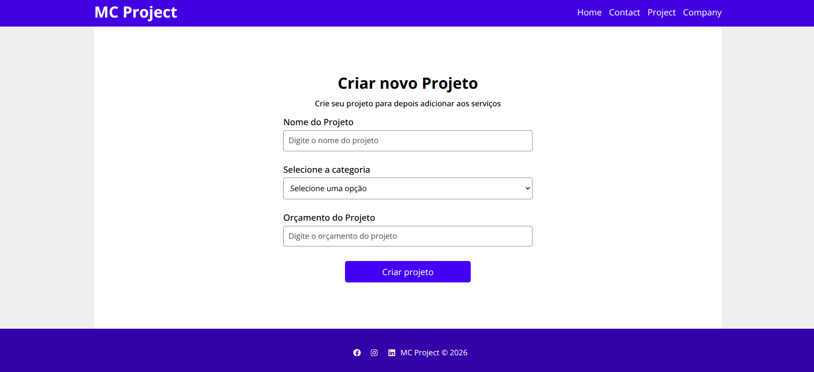
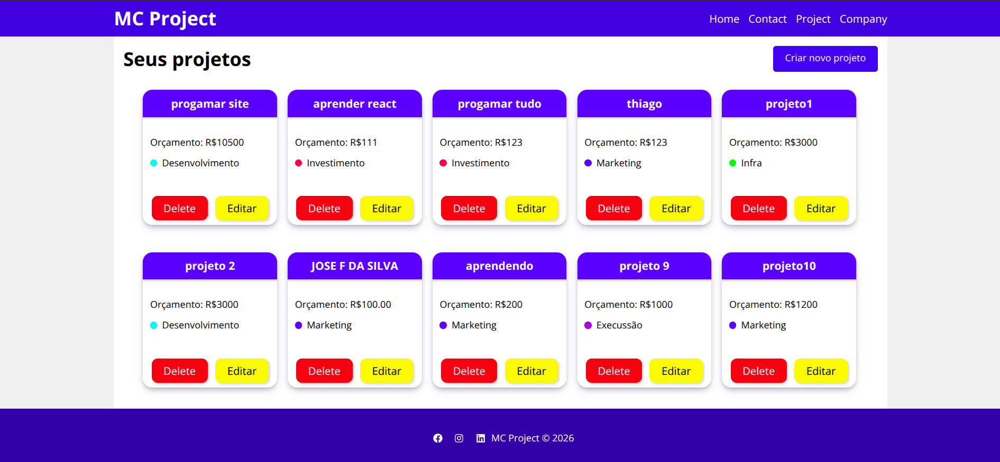

## Gerenciador de Projetos ainda em desenvolvimento

Aplicação desenvolvida em React para gerenciamento de projetos, permitindo criar, visualizar e organizar projetos por categorias.

## 🚀 Tecnologias utilizadas

React
React Router DOM
React Icons
CSS Modules
JSON Server (db.json) para simulação de banco de dados
UUID para geração de identificadores únicos

## 📁 Estrutura do projeto

O projeto foi dividido em componentes para facilitar a organização e manutenção da aplicação:
Form → componentes relacionados aos formulários
Layout → estrutura visual da aplicação
Pages → páginas principais do sistema
Projeto → componentes responsáveis pelos projetos

## 📌 Funcionalidades

Criar projetos
Definir categorias para cada projeto
Navegação entre páginas utilizando React Router DOM
Armazenamento dos dados em um banco fake com db.json
Interface componentizada e organizada

## 🗂 Banco de dados

Foi utilizado o db.json como banco de dados fake através do JSON Server.
O sistema possui duas listas principais:

Categorias: Previamente definidas para classificação dos projetos.
Exemplos: Desenvolvimento, Design, Infraestrutura, Planejamento

Projetos: Lista onde ficam armazenados os projetos criados pelo usuário.

## Imagem da parte da criação

## Imagem dos projetos sendo listados

## ▶️ Como executar o projeto
Clone o repositório:
git clone <https://github.com/thiyaggo/React-projects-managers.git>

Entre na pasta do projeto:
cd nome-do-projeto

Instale as dependências:
npm install json-server react react-dom react-icons react-router-dom react-scripts uuid web-vitals

Inicie o projeto React:
npm start

Inicie o JSON Server:
npm run backend

🛠 Dependências principais
react-router-domjson-server

📷 Interface
O sistema possui uma interface simples e organizada para facilitar o gerenciamento dos projetos.

## 📄 Objetivo do projeto
Este projeto foi desenvolvido com o objetivo de praticar e aprender:

--Componentização no React
--Gerenciamento de rotas
--Manipulação de formulários
--Consumo de API fake com JSON Server
--Organização de estrutura de projetos React

## lembrandoque esse projeto ainda está em desenvolvimento e será atualizado futuramente